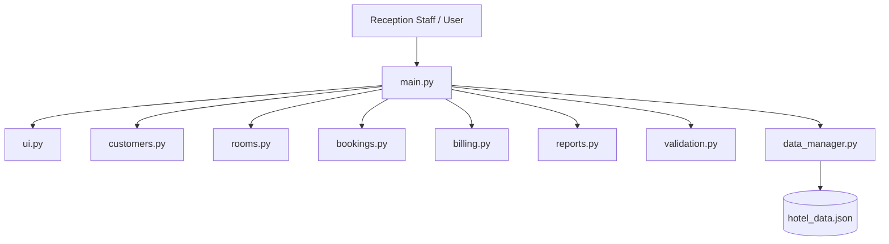
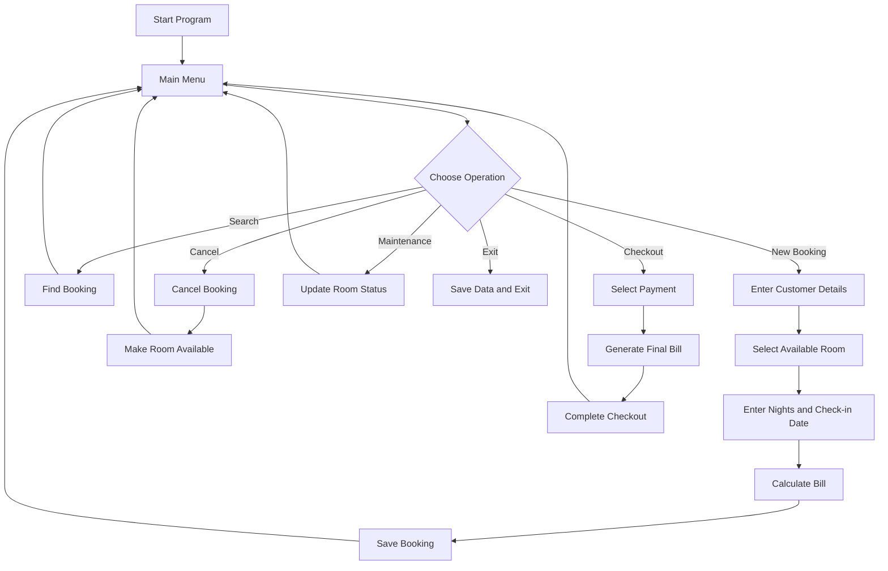
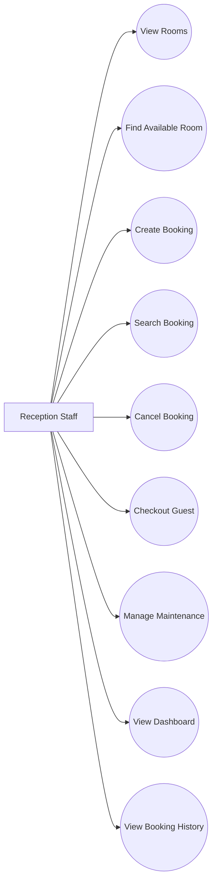
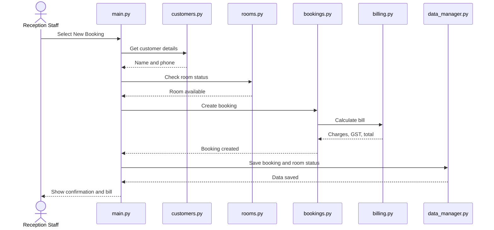
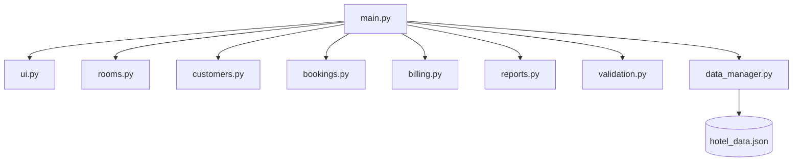
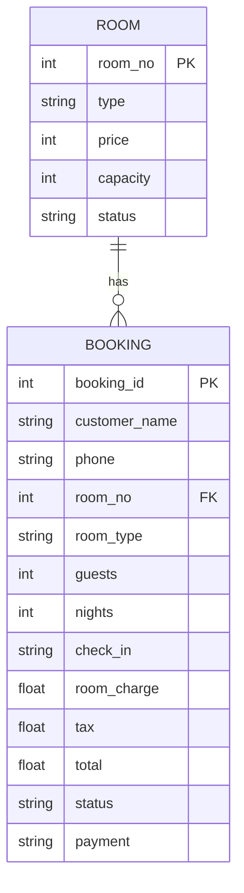

# Design Diagrams

The following diagrams describe the design of the hotel room booking system. GitHub can render Mermaid diagrams when this file is viewed in a compatible Markdown viewer.

## 1. System Architecture

## 2. Workflow Diagram

## 3. Use Case Diagram

## 4. Sequence Diagram - New Booking

## 5. Component / Module Diagram

## 6. Storage / ER-style Diagram

